# SC2 AI 中文教程

本文作者 @PolestarX **转载请注明出处** 

**禁止百家号使用本文任何内容**

程序基于deepmind开源 py-sc2

https://github.com/deepmind/pysc2

相关文档：

文档目录：https://github.com/Dentosal/python-sc2/wiki

sc2.BotAI类属性（包含一些全局操作API）：https://github.com/Dentosal/python-sc2/wiki/The-BotAI-class

单位及动作：https://github.com/Dentosal/python-sc2/wiki/Units-and-actions

单位能力及对应ID：https://github.com/Dentosal/python-sc2/wiki/Unit-abilities-and-IDs

原教程来自youtube [sentdex](https://www.youtube.com/channel/UCfzlCWGWYyIQ0aLC5w48gBQ) 和github的 [Dentosal](https://github.com/Dentosal) ，修复了一些原教程在当前版本可能出现的BUG

https://www.youtube.com/watch?v=v3LJ6VvpfgI&list=PLQVvvaa0QuDcT3tPehHdisGMc8TInNqdq&index=2&t=0s

https://pythonprogramming.net/scouting-visual-input-starcraft-ii-ai-python-sc2-tutorial/

战术策略参考：

https://github.com/Dentosal/python-sc2/tree/master/examples

单位名称/科技树查阅：

https://liquipedia.net/starcraft2/Protoss_Units_(Legacy_of_the_Void)

https://liquipedia.net/starcraft2/Terran_Units_(Legacy_of_the_Void)

https://liquipedia.net/starcraft2/Zerg_Units_(Legacy_of_the_Void)


## 前言

本教程为简略的星际2 AI编写**入门**demo,属于**娱乐**性质。玩家观看此教程之后开发出的谐星AI（比如XieStar），与作者无关。希望教程能起到抛砖引玉的效果。

使用者有一点点Python基础和对星际2的粗略了解即可完成本教程。

本人不是深度学习从业人员，也没有强大的硬件支持，因此暂时不涉及深度学习相关内容。如果教程播放量比较多的话，再考虑后续的部分吧。当然英语过关的老哥也可以自行观看后续内容。deeplearning部分涉及到一些额外知识，推荐先选择性观看sentdex的machine learning series教程，这样在后期训练模型时会对一些术语有一个初步的了解。

感谢deepmind为开源社区做出的贡献，也向youtube的sentdex致敬。

------

**以下内容可略过不看，直接跳到教程部分。**  

从围棋到DOTA2，AI似乎无往不利。Alphastar对战人类10:1的战绩被广泛传播，甚至有无良营销号打出AI 10:0完胜人类的标题。然而在Mana唯一获胜的那场直播中，正面操作无懈可击的Alphastar被一个棱镜耍得晕头转向，变成了F2 AI。星际2作为RTS游戏的代表，其拥有的战争迷雾机制和巨大的策略空间，对AI来说是从未有过的挑战。几百年的训练时间培养出了正面、多线操作和运营方面的怪物，然而与训练时间不相匹配的是孱弱的大局观。演示局结束后，deepmind的研发人员接受现场采访，他们并没有沉浸在巨大比分优势的喜悦中，而是很清楚地认识到，人类玩家在这11盘中都没有使用早期战术，而且最后一盘的反击则让AI的劣势显露无疑。Alphastar还有很多需要完善的地方。

最近Alphastar开始在欧服天梯上匿名训练，让星际玩家又多了几分期待。~~AI小儿只敢隐姓埋名，定是畏惧我谐星战术，真懦夫也。~~感谢暴雪创造了这个伟大的RTS游戏，感谢deepmind为我们揭示了这款游戏的别样魅力，感谢星际2的玩家们成就了电子竞技！

星际2是否是人类在游戏方面与AI抗衡的最后一个堡垒？我们拭目以待。

I don't see why a game needs to be big for someone to love playing it. ——Naniwa

#### GL HF !


## 教程

### **Ch1. 开发环境简介以及简单的采矿操作**

第一节教程旨在了解星际2 API和pysc2的基本安装、使用方法，并编写一个可以自动采矿的AI。

我的开发环境：

```
软件：Win10、Python3.6、星际2 4.9.3版本  
硬件：E3 1231v3、20GB DDR3、GTX 970M
# 必须先装好python开发环境，过程此处不再赘述
```

1. Mac或者Win平台安装星际2游戏，linux平台暂无（我用的win平台。不用linux的原因是linux没有完整的游戏界面）

2. https://github.com/deepmind/pysc2    clone仓库或

   直接pip安装（我用的pip）：执行`pip install pysc2` 版本号2.0.2

3. https://github.com/Blizzard/s2client-proto#downloads 下载地图包，我下载了19年第一赛季的地图

4. 解压地图包到游戏目录的Maps文件夹下，如果没有就新建（密码： iagreetotheeula）注意保留地图包文件夹，不要直接把rep文件放到Maps文件夹中。

5. 修改sc2包中的paths.py 修改对应平台的游戏路径（此处修改win平台）

   ```python
   BASEDIR = {
       "Windows": "F:\Games\StarCraft II", # 修改此处
       "Darwin": "/Applications/StarCraft II",
       "Linux": "~/StarCraftII",
       "WineLinux": "~/.wine/drive_c/Program Files (x86)/StarCraft II",
   }
   ```

6. 编写代码并运行，可以看到游戏界面（可能会遇到错误，解决方法看本节最后）

   API查阅：https://github.com/Dentosal/python-sc2/wiki

   ```python
   """
   一个简单的入门程序 星际2 4.9.3版本测试通过
   PvP 对手简单电脑 我方AI只采矿 地图为AutomatonLE
   """
   import sc2
   # run_game用于启动游戏并指定各项启动参数
   # maps指定游戏在哪张地图上运行。Race选择种族，Difficulty选择电脑难度。
   from sc2 import run_game, maps, Race, Difficulty
   # Bot和Computer分别指你自己写的AI和游戏内置的电脑
   from sc2.player import Bot, Computer
   
   
   class SentdeBot(sc2.BotAI):
       """
       这个类就是你要写的AI类，必须要继承sc2.BotAI，很多内置方法都在其中
       """
   
       async def on_step(self, iteration: int):
           """
           on_step这个异步方法必须被重写，再此将会调用你设置的每一步指令。
           """
           # distribute_workers是内置方法，代表自动让农民采矿
           await self.distribute_workers()
   
   
   def main():
       run_game(maps.get("AutomatonLE"), [
           Bot(Race.Protoss, SentdeBot()),
           Computer(Race.Protoss, Difficulty.Easy)], realtime=True) 
   
   
   if __name__ == '__main__':
       main()
   
   ```

   那么，除了和电脑交战以外，如何**评估自己创造的AI实力**呢？很简单,改动一些代码即可：

   这样就可以与自己创造的AI对战了，运行程序之后会出现两个窗口，一个窗口是你操作的种族(下面代码中你将操作人族)，另一个窗口是你的AI（下面代码中AI使用虫族）。但必须指出的是，这样相当于双开游戏，对电脑配置要求较高（我的电脑已经非常卡了），调至职业选手画质会有很大的改善。

   ```python
   from sc2 import run_game, maps, Race
   from sc2.player import Bot, Human
   
   run_game(maps.get("AutomatonLE"), [
       Human(Race.Terran),
       Bot(Race.Zerg, SentdeBot())
   ], realtime=True)
   ```

   如果游戏放在固态硬盘里，启动会快很多。效果图如下：

   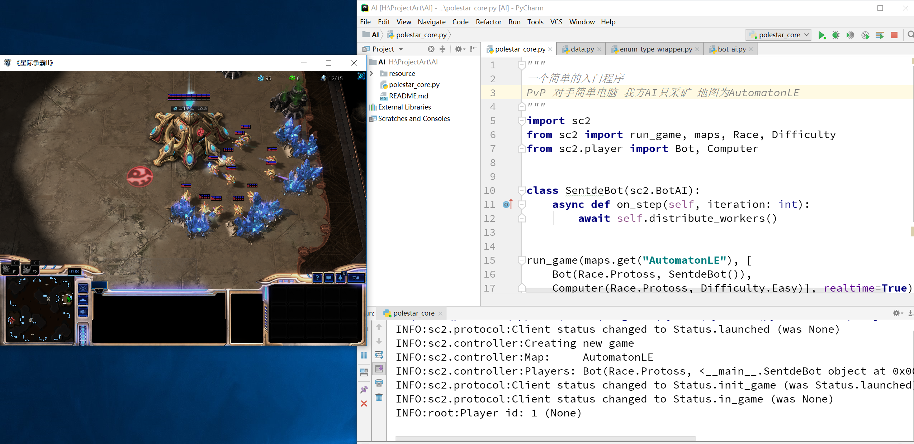

#### 错误记录：

ValueError: 3794 is not a valid AbilityId

版本问题引起。星际2现版本为4.9.3（19年7月）

https://www.bountysource.com/issues/74655708-valueerror-3794-is-not-a-valid-abilityid

ocnuybear commented on this issue 10 days ago.

1. Browse to c:\program files (x86)\microsoft visual studio\shared\python37_64\lib\site-packages\sc2 (I'm using Python in Visual Studio 2019 environment)
2. Edit game_data.py and comment out 'assert self.id != 0' with # in front, save changes.
3. Edit pixel_map.py and comment out 'assert self.bits_per_pixel % 8 == 0, "Unsupported pixel density"' with # in front, save changes.

Run again and game should work now fully updated on 4 Jul 2019


### **Ch2. 建造探机和水晶**

本节为AI增加了有余钱时自动建造水晶和探机的AI。不足之处是AI会一直建造探机，哪怕超过采矿效率上限。有概率一次补两个水晶，造成资源浪费。

**部分代码**如下：（完全版代码见文件夹内 ch2_Workers_and_Pylons.py ）

```python
"""
造农民和水晶
"""
import sc2
from sc2 import run_game, maps, Race, Difficulty
from sc2.player import Bot, Computer
from sc2.constants import NEXUS, PROBE, PYLON


class SentdeBot(sc2.BotAI):
    async def on_step(self, iteration: int):
        await self.distribute_workers()
        await self.build_workers()
        await self.build_pylons()

    async def build_workers(self):
        """
        选择空闲基地建造农民
        noqueue意味着当前建造列表为空
        """
        for nexus in self.units(NEXUS).ready.noqueue:
            if self.can_afford(PROBE):
                await self.do(nexus.train(PROBE))

    async def build_pylons(self):
        """
        人口空余不足5时造水晶。
        """
        if self.supply_left < 5 and not self.already_pending(PYLON):
            nexuses = self.units(NEXUS).ready
            if nexuses.exists:
                if self.can_afford(PYLON):
                    await  self.build(PYLON, near=nexuses.first) # near表示建造地点。后期可以用深度学习优化
                            
        """
        此处略去部分内容
        """
```

效果如下：

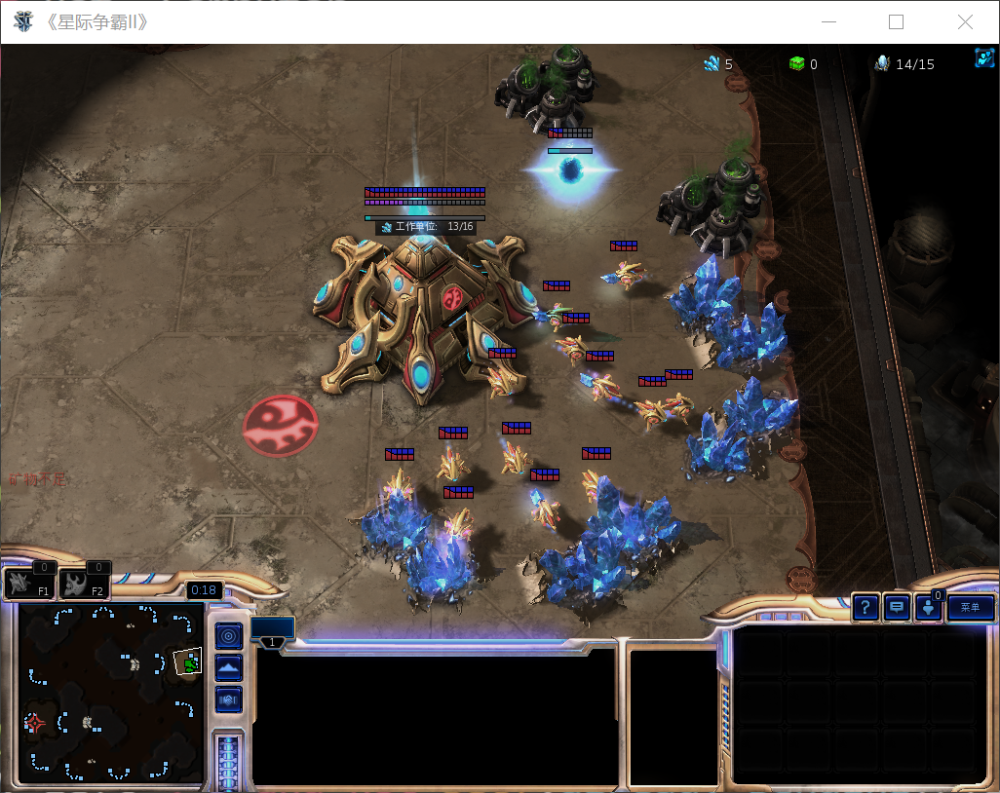

#### 错误记录：

"from sc2.constants import PROBE" not working 

某些IDE造成的问题，直接用IDLE可以运行。或者像我的代码里一样加上 `if __name__ == '__main__':`部分代码即可。

https://github.com/Dentosal/python-sc2/issues/58

https://github.com/Dentosal/python-sc2/issues/104

You can avoid it by doing:

```
from sc2.ids.unit_typeid import UnitTypeId
from sc2.ids.ability_id import AbilityId
from sc2.ids.buff_id import BuffId
from sc2.ids.upgrade_id import UpgradeId
from sc2.ids.effect_id import EffectId
```

This is probably the better choice because **VScode and pycharm** both mark the enums red if you dont have a `UnitTypeId.` in front of the name, unless you disabled that warning.

Also, see [#58](https://github.com/Dentosal/python-sc2/issues/58) and [#55](https://github.com/Dentosal/python-sc2/issues/55)

Sidenote:
There isn't anything we can do since these are the names directly from the SC2 API.


### Ch3.  采气及扩张

这一节为AI增加了采气和关键的扩张逻辑。但是，AI会直接扩张（雅典娜的惊叹），**没有任何战斗单位防御**，并且还是会一直补农民。run_game函数的realtime参数设为False可以加速游戏进程，方便获取结果。

部分代码

```python
from sc2.constants import NEXUS, PROBE, PYLON, ASSIMILATOR

class SentdeBot(sc2.BotAI):
    async def on_step(self, iteration: int):
        await self.distribute_workers()
        await self.build_workers()
        await self.build_pylons()
        await self.build_assimilators()
        await self.expand()
        
        """
        此处略去部分内容
        """
        
    async def build_assimilators(self):
        """
        建造气矿
        """
        for nexus in self.units(NEXUS).ready:
            vespenes = self.state.vespene_geyser.closer_than(25.0, nexus)
            for vespene in vespenes:
                if not self.can_afford(ASSIMILATOR):
                    break
                worker = self.select_build_worker(vespene.position)
                if worker is None:
                    break
                if not self.units(ASSIMILATOR).closer_than(1.0, vespene).exists:
                    await self.do(worker.build(ASSIMILATOR, vespene))

    async def expand(self):
        """
        何时扩张 简化版
        基地数量少于3个就立即扩张
        """
        if self.units(NEXUS).amount < 3 and self.can_afford(NEXUS):
            await self.expand_now()


def main():
    run_game(maps.get("AutomatonLE"), [
        Bot(Race.Protoss, SentdeBot()),
        Computer(Race.Protoss, Difficulty.Easy)], realtime=False)  # realtime设为False可以加速


if __name__ == '__main__':
    main()
```

效果如下，AI已经学会采气（虽然有时气矿建造位置诡异），并开始开三矿：

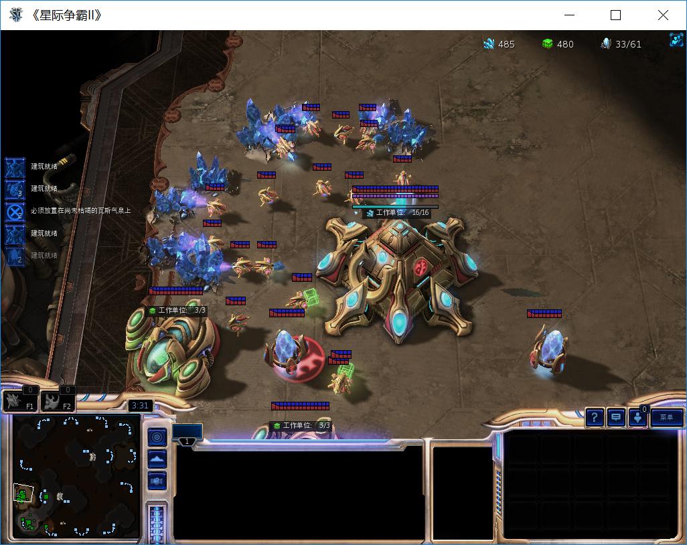


### Ch4 建造战斗单位

这一节中为AI增加建造战斗单位及其前置建筑的能力。缺点是AI只会单兵营出追猎。追猎没有主动进攻能力，不会保护己方单位。不过既然AI已经有能力生产战斗单位，那么离胜利也就更进一步了。

部分代码如下：

```python
from sc2.constants import NEXUS, PROBE, PYLON, ASSIMILATOR, GATEWAY, \
    CYBERNETICSCORE, STALKER
    
class SentdeBot(sc2.BotAI):
    async def on_step(self, iteration: int):
        await self.distribute_workers()
        await self.build_workers()
        await self.build_pylons()
        await self.build_assimilators()
        await self.expand()
        await self.offensive_force_buildings()
        await self.build_offensive_force()

        """
        此处略去部分内容
        """

    async def offensive_force_buildings(self):
        """
        建造产兵建筑
        """
        if self.units(PYLON).ready.exists:
            pylon = self.units(PYLON).ready.random
            if self.units(GATEWAY).ready.exists:
                if not self.units(CYBERNETICSCORE):
                    if self.can_afford(CYBERNETICSCORE) and not self.already_pending(CYBERNETICSCORE):
                        await self.build(CYBERNETICSCORE, near=pylon)
            else:
                if self.can_afford(GATEWAY) and not self.already_pending(GATEWAY):
                    await self.build(GATEWAY, near=pylon)

    async def build_offensive_force(self):
        """
        建造战斗单位
        """
        for gw in self.units(GATEWAY).ready.noqueue:
            if self.can_afford(STALKER) and self.supply_left > 0:
                await self.do(gw.train(STALKER))
```

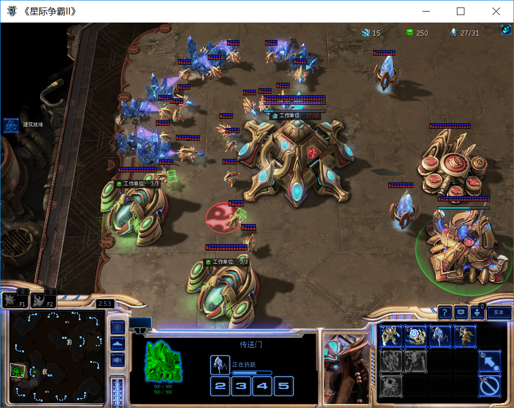


### Ch5 血战简单电脑！给战斗单位下达指令

这一节将为AI的战斗单位增加防御和进攻指令，并建造多个产兵建筑。在扩张的同时，AI会建造三个BG爆追猎，当追猎数量超过5个时会主动攻击视野中的敌人，超过15个时就会主动进攻敌方出生点。

**部分**代码：

```python
import random

class SentdeBot(sc2.BotAI):
    async def on_step(self, iteration: int):
        await self.distribute_workers()
        await self.build_workers()
        await self.build_pylons()
        await self.build_assimilators()
        await self.expand()
        await self.offensive_force_buildings()
        await self.build_offensive_force()
        await self.attack()
        
	async def offensive_force_buildings(self):
        """
        建造产兵建筑
        """
        if self.units(PYLON).ready.exists:
            pylon = self.units(PYLON).ready.random
            if self.units(GATEWAY).ready.exists and not self.units(CYBERNETICSCORE):
                if self.can_afford(CYBERNETICSCORE) and not self.already_pending(CYBERNETICSCORE):
                    await self.build(CYBERNETICSCORE, near=pylon)
            elif len(self.units(GATEWAY)) <= 3:
                if self.can_afford(GATEWAY) and not self.already_pending(GATEWAY):
                    await self.build(GATEWAY, near=pylon)
	def find_target(self, state):
        """
        寻找敌方单位
        注意这个函数不是异步的，不用加async
        """
        if len(self.known_enemy_units) > 0:
            return random.choice(self.known_enemy_units)
        elif len(self.known_enemy_structures) > 0:
            return random.choice(self.known_enemy_structures)
        else:
            return self.enemy_start_locations[0]

    async def attack(self):
        """
        控制追猎攻击视野内敌方单位
        """
        if self.units(STALKER).amount > 15:  # 追猎数量够多时主动出击
            for s in self.units(STALKER).idle:
                await self.do(s.attack(self.find_target(self.state)))

        if self.units(STALKER).amount > 5:
            if len(self.known_enemy_units) > 0:
                for s in self.units(STALKER).idle:
                    await self.do(s.attack(random.choice(self.known_enemy_units)))


def main():
    run_game(maps.get("AutomatonLE"), [
        Bot(Race.Protoss, SentdeBot()),
        Computer(Race.Protoss, Difficulty.Medium)], realtime=False)  # realtime设为False可以加速


if __name__ == '__main__':
    main()
```

我们**首次战胜**了简单电脑以及中等难度电脑。仅用时8分29秒，~~AI稳稳超越<国服第三>太子的水平~~：


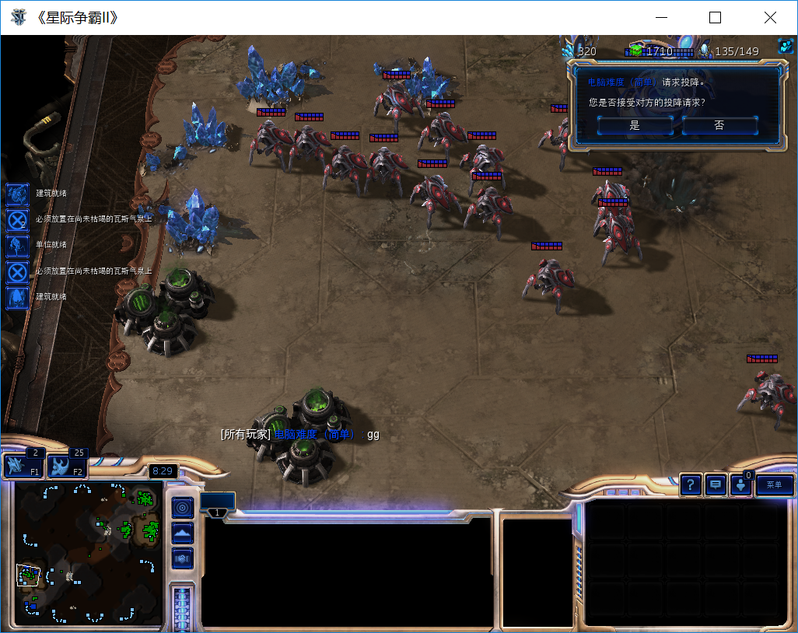

但AI输给了拥有多种兵种组合的**困难**电脑，第一波15个追猎过去，电脑的不朽/虚空已经出来了。仅凭追猎要打赢还是有难度。而且战斗过程中，AI不会操作残血追猎，极大地增加了战损。


### Ch6 击败困难电脑！

上一章AI完成了历史性任务：击败简单电脑。但是AI还不懂兵种组合，没有时间概念。这一章我们将优化产兵建筑数量，建立BG数量和时间的关系。AI在造好15个追猎就F2A了，而后续的追猎则是一个一个进攻对方基地，如果第一波进攻失败，那就成了添油战术送兵了。

注意on_setp函数的iteration参数，这将和游戏时钟建立关系。

这一节继续优化AI的建造流程。BG数量将粗略地和时间挂钩，同时生产农民也将持续优化（加上限制）。AI还将建造新的单位。同时，建造战斗单位的代码也需要调整，因为AI总是先生产便宜的单位，昂贵的单位就可能因为资源不足一直无法生产。

```python
class SentdeBot(sc2.BotAI):
    def __init__(self):
        self.ITERATIONS_PER_MINUTE = 165
        self.MAX_WORKERS = 80  # 限制最大农民数

    async def on_step(self, iteration: int):  # iteration类似游戏时钟 每分钟165个迭代(待确认)
        self.iteration = iteration
        await self.distribute_workers()
        await self.build_workers()
        await self.build_pylons()
        await self.build_assimilators()
        await self.expand()
        await self.offensive_force_buildings()
        await self.build_offensive_force()
        await self.attack()

    async def build_workers(self):
        """
        选择空闲基地建造农民
        noqueue意味着当前建造列表为空
        """
        if len(self.units(NEXUS)) * 24 > len(self.units(PROBE)):  # 每矿农民补满就不补了
            if len(self.units(PROBE)) < self.MAX_WORKERS:
                for nexus in self.units(NEXUS).ready.noqueue:
                    if self.can_afford(PROBE):
                        await self.do(nexus.train(PROBE))
    async def offensive_force_buildings(self):
        """
        建造产兵/科技建筑
        """
        print('iterations:', self.iteration / self.ITERATIONS_PER_MINUTE)
        if self.units(PYLON).ready.exists:
            pylon = self.units(PYLON).ready.random
            # 建造BY
            if self.units(GATEWAY).ready.exists and not self.units(CYBERNETICSCORE):
                if self.can_afford(CYBERNETICSCORE) and not self.already_pending(CYBERNETICSCORE):
                    await self.build(CYBERNETICSCORE, near=pylon)
            # 建造更多BG
            elif len(self.units(GATEWAY)) < ((self.iteration / self.ITERATIONS_PER_MINUTE) / 2):  # 粗略计算
                if self.can_afford(GATEWAY) and not self.already_pending(GATEWAY):
                    await self.build(GATEWAY, near=pylon)
            # 这个VS放的早啊
            if self.units(CYBERNETICSCORE).ready.exists:
                if len(self.units(STARGATE)) < ((self.iteration / self.ITERATIONS_PER_MINUTE) / 2):
                    if self.can_afford(STARGATE) and not self.already_pending(STARGATE):
                        await self.build(STARGATE, near=pylon)

    async def build_offensive_force(self):
        """
        建造战斗单位
        """
        for gw in self.units(GATEWAY).ready.noqueue:
            if not self.units(STALKER).amount > self.units(VOIDRAY).amount:  # 粗略判断
                if self.can_afford(STALKER) and self.supply_left > 0:
                    await self.do(gw.train(STALKER))

        for sg in self.units(STARGATE).ready.noqueue:
            if self.can_afford(VOIDRAY) and self.supply_left > 0:
                await self.do(sg.train(VOIDRAY))

```

当AI开始建造更多的建筑时，糟糕的摆放位置影响可能会越来越大。例如下图中，水晶和VS完全挡住了采矿的路径。~~令人智熄的操作.jpg~~

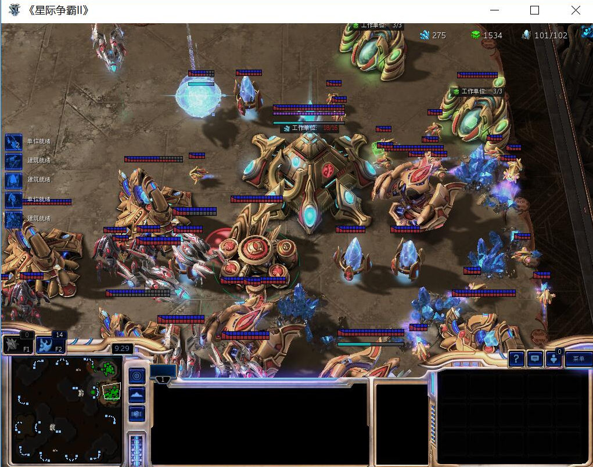

经过一番血战，无敌虚空为AI拿下了第一场对战困难电脑的胜利（并不是100%的胜率）~~180人口虚空带追猎怎么输~~

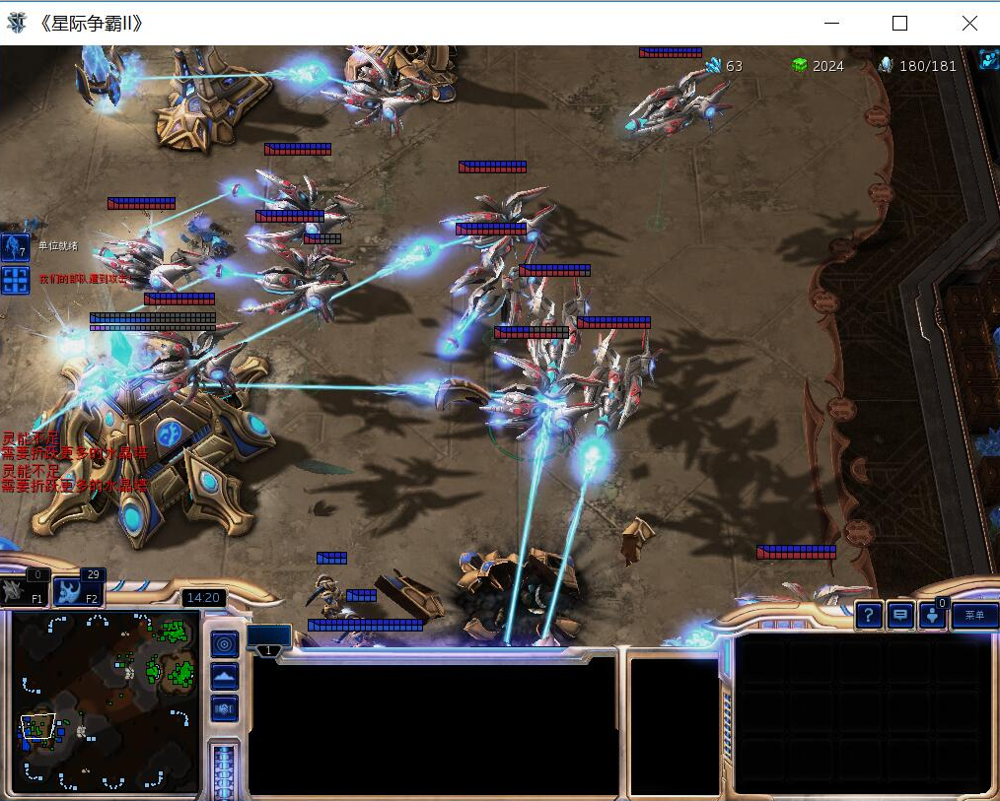


你也可以学习别人写好的程序，例如修电脑炮台并发表情跳他（也有可能电脑转进二矿，然后你的探机就会在别人家主矿修满地堡但就是不去别人二矿）

https://github.com/Dentosal/python-sc2/blob/master/examples/protoss/cannon_rush.py

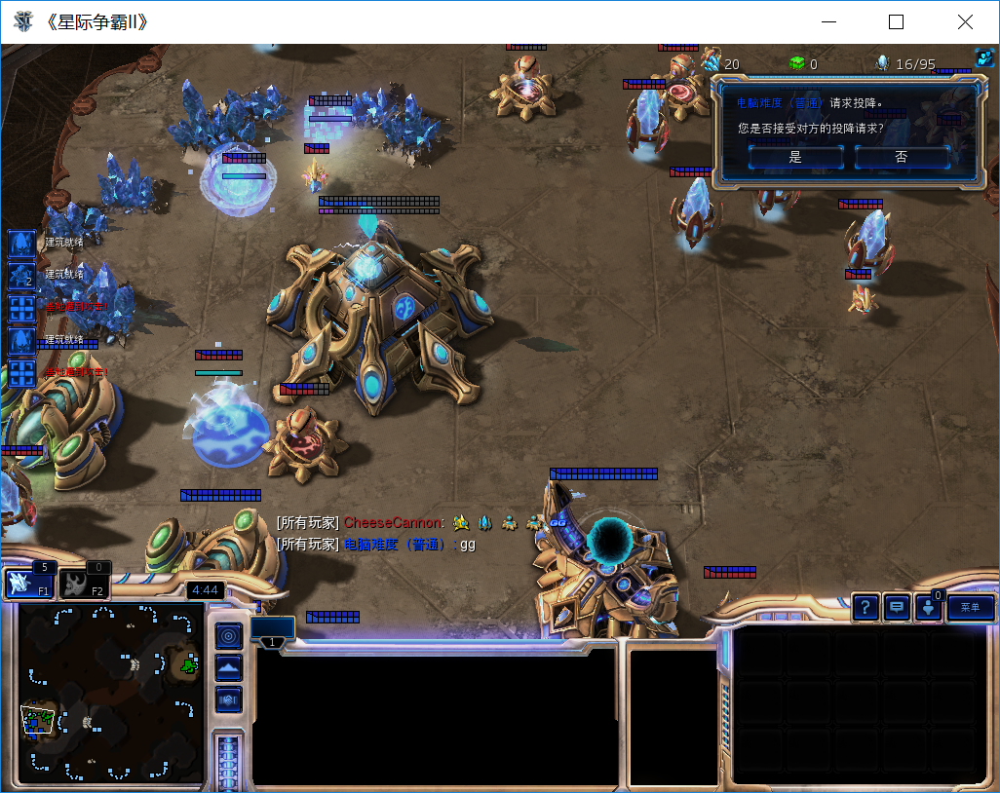


### Ch7 SC2深度学习导言（应用深度学习前的准备工作）

由于星际2有非常多的变量，建筑摆放位置、建造流程、timing点、交战操作和兵种配比都是极其复杂的问题，完全硬编码想要达到很好的效果难度非常大。

到上一章为止，我们所有的策略都是硬编码的，还算不上真正的AI。从这章开始，我们要动手实现深度学习。那么问题来了：没有现成模型可用的情况下，如何应用深度学习？

首先我们要把问题简化、抽象化。或许一个可行的解决办法是：先将行为分为几个决策（攻击敌方建筑、攻击敌方单位或是防守己方基地等），再应用到空闲单位上。后续我们再考虑将学习应用到运营流程中。

我们现在知道了神经网络的输出，那么输入应该是什么呢？

有人或许会说要用经典强化学习算法 *Q*-*learning* ，但是对这种问题来说过于复杂了。这会使用极大的数据样本，意义很小并且过程繁琐。原作者更倾向于使用evolutionary learning method。

一个可用的、简单的神经网络是卷积神经网络（*Convolutional Neural Network*s, CNN），因为你可以用它来可视化一切。刚开始应用CNN时，你需要**尽可能地简化问题**。当初步实践成功时，再尝试更复杂的解决方案。

首先，我们不在把追猎放在首要位置，我们想优先生产更多虚空。但追猎也必不可少，因为要靠它抵挡前期的一波。另外，我们保持attack函数不变。我们不再需要更多的BG，造一个BG只是为了解锁后面的建筑。（但实际我们仍需要生产少量的追猎。不过为了简化问题，先只生产虚空，后续再考虑这个）。build_offensive_force函数只生产虚空，这样就将作战单位简化为了一种（~~单一兵种作战？~~）。

接下来我们就要使用测试数据并分辨正确和错误的选择。

导入两个库：cv2（OpenCV）和numpy   

部分代码：

```python
import cv2
import numpy as np

class SentdeBot(sc2.BotAI):
    def __init__(self):
        self.ITERATIONS_PER_MINUTE = 165
        self.MAX_WORKERS = 80  # 限制最大农民数

    async def on_step(self, iteration: int):  # iteration类似游戏时钟 每分钟165个迭代(待确认)
        self.iteration = iteration
        await self.distribute_workers()
        await self.build_workers()
        await self.build_pylons()
        await self.build_assimilators()
        await self.expand()
        await self.offensive_force_buildings()
        await self.build_offensive_force()
        await self.attack()
        await self.intel()

    async def intel(self):
        """
        原作者随便起的名字，你也可以起名为AMD_YES
        该函数将游戏运行过程可视化
        """
        print('dir:', dir(self))  # 你总是可以使用dir命令来获取帮助，也可以直接看源码
        game_data = np.zeros((self.game_info.map_size[1], self.game_info.map_size[0], 3), np.uint8)  # 反转图片像素
        # 画出每个基地的位置
        for nexus in self.units(NEXUS):
            nex_pos = nexus.position
            cv2.circle(game_data, (int(nex_pos[0]), int(nex_pos[1])),
                       10, (0, 255, 0), -1)  # 10代表尺寸,三坐标代表RGB,-1代表描边线宽

        # 转换坐标
        flipped = cv2.flip(game_data, 0)  # 翻转
        resized = cv2.resize(flipped, dsize=None, fx=2, fy=2)
        cv2.imshow('Intel', resized)
        cv2.waitKey(1)  # 1ms
        
    async def offensive_force_buildings(self):
        """
        建造产兵/科技建筑
        """
        if self.units(PYLON).ready.exists:
            pylon = self.units(PYLON).ready.random
            # 建造BY
            if self.units(GATEWAY).ready.exists and not self.units(CYBERNETICSCORE):
                if self.can_afford(CYBERNETICSCORE) and not self.already_pending(CYBERNETICSCORE):
                    await self.build(CYBERNETICSCORE, near=pylon)
            # 建造1个BG解锁科技即可
            elif len(self.units(GATEWAY)) < 1:
                if self.can_afford(GATEWAY) and not self.already_pending(GATEWAY):
                    await self.build(GATEWAY, near=pylon)
            # 这个VS放的早啊
            if self.units(CYBERNETICSCORE).ready.exists:
                if len(self.units(STARGATE)) < (self.iteration / self.ITERATIONS_PER_MINUTE):
                    if self.can_afford(STARGATE) and not self.already_pending(STARGATE):
                        await self.build(STARGATE, near=pylon)

    async def build_offensive_force(self):
        """
        建造战斗单位（只要虚空）
        """
        for sg in self.units(STARGATE).ready.noqueue:
            if self.can_afford(VOIDRAY) and self.supply_left > 0:
                await self.do(sg.train(VOIDRAY))
```


OpenCV库将每个基地的位置显示在模拟地图上：


### Ch8 侦查以及更多可视化输入（还是准备工作）

OpenCV生成的图形是为了让我们更好地了解到游戏内发生的事情。

在这一章，我们要描绘更多的单位，并为它们增加不同的颜色和尺寸。

```python
    async def intel(self):
        """
        原作者随便起的名字，你也可以起名为amd
        该函数将游戏运行过程可视化
        """
        print('dir:', dir(self))  # 你总是可以使用dir命令来获取帮助，也可以直接看源码
        game_data = np.zeros((self.game_info.map_size[1], self.game_info.map_size[0], 3), np.uint8)  # 反转图片像素

        # UNIT:[SIZE,(RGB COLOR)]
        draw_dict = {
            NEXUS: [15, (0, 255, 0)],
            PYLON: [3, (20, 235, 0)],
            PROBE: [1, (55, 200, 0)],
            ASSIMILATOR: [2, (55, 200, 0)],
            GATEWAY: [3, (200, 100, 0)],
            CYBERNETICSCORE: [3, (150, 150, 0)],
            STARGATE: [5, (255, 0, 0)],
            VOIDRAY: [3, (255, 100, 0)],
        }

        # 画出每个单位的位置
        for unit_type in draw_dict:
            for unit in self.units(unit_type).ready:
                pos = unit.position
                cv2.circle(game_data, (int(pos[0]), int(pos[1])),
                           draw_dict[unit_type][0], draw_dict[unit_type][1], -1)

        # 转换坐标
        flipped = cv2.flip(game_data, 0)  # 翻转
        resized = cv2.resize(flipped, dsize=None, fx=2, fy=2)
        cv2.imshow('Intel', resized)
        cv2.waitKey(1)  # 1ms
```

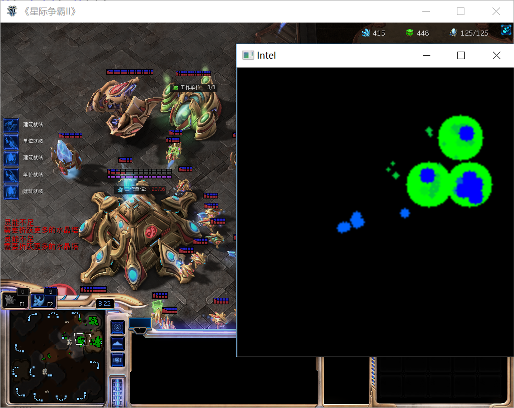

在此之后，还要为AI增加侦查的能力（例如建造OB等）。侦查是十分重要的工作，因为神经网网络的输入就是依靠地图上能看到的信息。因此我们需要建造VR和OB。部分代码如下：

```python
from sc2 import run_game, maps, Race, Difficulty, position
from sc2.constants import NEXUS, PROBE, PYLON, ASSIMILATOR, GATEWAY, \
    CYBERNETICSCORE, STALKER, STARGATE, VOIDRAY, OBSERVER, ROBOTICSFACILITY
    
class SentdeBot(sc2.BotAI):
    def __init__(self):
        self.ITERATIONS_PER_MINUTE = 165
        self.MAX_WORKERS = 80  # 限制最大农民数

    async def on_step(self, iteration: int):  # iteration类似游戏时钟 每分钟165个迭代(待确认)
        self.iteration = iteration
        await self.scout()
        await self.distribute_workers()
        await self.build_workers()
        await self.build_pylons()
        await self.build_assimilators()
        await self.expand()
        await self.offensive_force_buildings()
        await self.build_offensive_force()
        await self.attack()
        await self.intel()

    def random_location_variance(self, enemy_start_location):
        """
        随机给出敌方主矿附近的侦查坐标
        :param enemy_start_location: 敌方出生点
        :return: 侦查坐标
        """
        x = enemy_start_location[0]
        y = enemy_start_location[1]

        x += ((random.randrange(-20, 20)) / 100) * enemy_start_location[0]
        y += ((random.randrange(-20, 20)) / 100) * enemy_start_location[1]

        if x < 0:
            x = 0
        if y < 0:
            y = 0
        if x > self.game_info.map_size[0]:
            x = self.game_info.map_size[0]
        if y > self.game_info.map_size[1]:
            y = self.game_info.map_size[1]
        # 无法直接返回xy二维坐标，大概因为游戏是三维的原因。需要用sc2的position转换坐标 注意传入的是tuple
        go_to = position.Point2(position.Pointlike((x, y)))
        return go_to

    async def scout(self):
        """
        侦查部分
        """
        if len(self.units(OBSERVER)) > 0:
            scout = self.units(OBSERVER)[0]
            if scout.is_idle:
                enemy_location = self.enemy_start_locations[0]
                move_to = self.random_location_variance(enemy_location)
                print(move_to)
                await self.do(scout.move(move_to))
        else:
            for rf in self.units(ROBOTICSFACILITY).ready.noqueue:
                if self.can_afford(OBSERVER) and self.supply_left > 0:
                    await self.do(rf.train(OBSERVER))

    async def intel(self):
        """
        原作者随便起的名字，你也可以起名为amd
        该函数将游戏运行过程可视化
        """
        # print('dir:', dir(self))  # 你总是可以使用dir命令来获取帮助，也可以直接看源码
        game_data = np.zeros((self.game_info.map_size[1], self.game_info.map_size[0], 3), np.uint8)  # 反转图片像素

        # UNIT:[SIZE,(RGB COLOR)]
        draw_dict = {
            NEXUS: [15, (0, 255, 0)],
            PYLON: [3, (20, 235, 0)],
            PROBE: [1, (55, 200, 0)],
            ASSIMILATOR: [2, (55, 200, 0)],
            GATEWAY: [3, (200, 100, 0)],
            CYBERNETICSCORE: [3, (150, 150, 0)],
            STARGATE: [5, (255, 0, 0)],
            VOIDRAY: [3, (255, 100, 0)],
        }

        # 画出每个单位的位置
        for unit_type in draw_dict:
            for unit in self.units(unit_type).ready:
                pos = unit.position
                cv2.circle(game_data, (int(pos[0]), int(pos[1])),
                           draw_dict[unit_type][0], draw_dict[unit_type][1], -1)

        # 画出敌方单位位置
        main_base_names = ["nexus", "commandcenter", "hatchery"]
        for enemy_building in self.known_enemy_structures:
            pos = enemy_building.position
            if enemy_building.name.lower() not in main_base_names:
                cv2.circle(game_data, (int(pos[0]), int(pos[1])), 5, (200, 50, 212), -1)
        for enemy_building in self.known_enemy_structures:
            pos = enemy_building.position
            if enemy_building.name.lower() in main_base_names:
                cv2.circle(game_data, (int(pos[0]), int(pos[1])), 15, (0, 0, 255), -1)

        # 区分战斗单位和工作单位
        for enemy_unit in self.known_enemy_units:
            if not enemy_unit.is_structure:
                worker_names = ["probe",
                                "scv",
                                "drone"]
                # if that unit is a PROBE, SCV, or DRONE... it's a worker
                pos = enemy_unit.position
                if enemy_unit.name.lower() in worker_names:
                    cv2.circle(game_data, (int(pos[0]), int(pos[1])), 1, (55, 0, 155), -1)
                else:
                    cv2.circle(game_data, (int(pos[0]), int(pos[1])), 3, (50, 0, 215), -1)

        # 画出OB位置，尺寸尽可能小，以突出侦查的重要信息
        for obs in self.units(OBSERVER).ready:
            pos = obs.position
            cv2.circle(game_data, (int(pos[0]), int(pos[1])), 1, (255, 255, 255), -1)

        # 转换坐标
        flipped = cv2.flip(game_data, 0)  # 翻转
        resized = cv2.resize(flipped, dsize=None, fx=2, fy=2)
        cv2.imshow('Intel', resized)
        cv2.waitKey(1)  # 1ms
        
    async def offensive_force_buildings(self):
        """
        建造产兵/科技建筑
        """
        if self.units(PYLON).ready.exists:
            pylon = self.units(PYLON).ready.random
            # 建造BY
            if self.units(GATEWAY).ready.exists and not self.units(CYBERNETICSCORE):
                if self.can_afford(CYBERNETICSCORE) and not self.already_pending(CYBERNETICSCORE):
                    await self.build(CYBERNETICSCORE, near=pylon)
            # 建造1个BG解锁科技即可
            elif len(self.units(GATEWAY)) < 1:
                if self.can_afford(GATEWAY) and not self.already_pending(GATEWAY):
                    await self.build(GATEWAY, near=pylon)

            # 造VR，准备出OB
            if self.units(CYBERNETICSCORE).ready.exists:
                if len(self.units(ROBOTICSFACILITY)) < 1:
                    if self.can_afford(ROBOTICSFACILITY) and not self.already_pending(ROBOTICSFACILITY):
                        await self.build(ROBOTICSFACILITY, near=pylon)

            # 这个VS放的早啊
            if self.units(CYBERNETICSCORE).ready.exists:
                if len(self.units(STARGATE)) < (self.iteration / self.ITERATIONS_PER_MINUTE):
                    if self.can_afford(STARGATE) and not self.already_pending(STARGATE):
                        await self.build(STARGATE, near=pylon)
```

下图的白点就是OB，正飞向对方主矿侦查~~（然后就被炮台打下来了）~~


### Ch9 建立神经网络训练数据

在开展任何机器学习前，我们都要**建立自己的数据集**。这一章我们终于可以开始做这个最后的准备工作了。

还有一点数据可视化的工作是：在图像左下角用横条形式追踪当前的资源和人口数据，为平衡战斗单位的资源/人口消耗做准备。

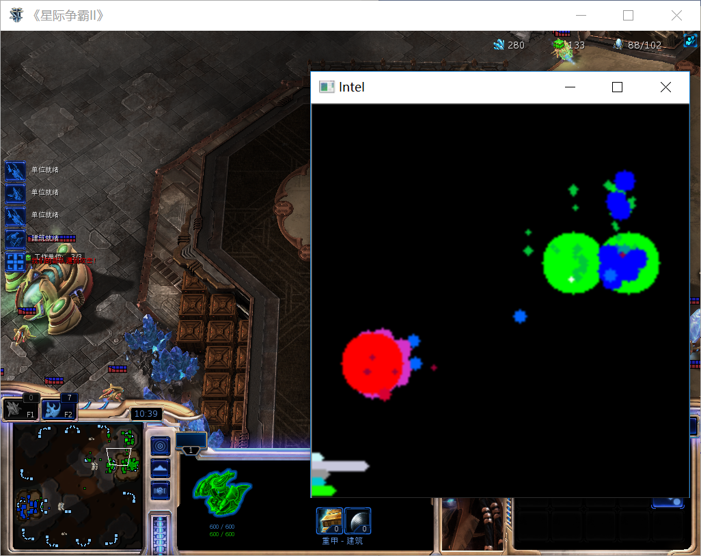

接下来我们要修改attack函数，同时还要引入游戏结果（胜/负），以判断训练数据的正确性。

我们对这个AI进行的第一项深度学习改造就是让AI判断攻击选择的正确与否。

```python
    async def attack(self):
        """
        随机做出不同的攻击选择
        """
        if len(self.units(VOIDRAY).idle) > 0:
            choice = random.randrange(0, 4)
            target = False
            if self.iteration > self.do_something_after:
                if choice == 0:
                    # no attack
                    wait = random.randrange(20, 165)
                    self.do_something_after = self.iteration + wait

                elif choice == 1:
                    # attack_unit_closest_nexus
                    if len(self.known_enemy_units) > 0:
                        target = self.known_enemy_units.closest_to(random.choice(self.units(NEXUS)))

                elif choice == 2:
                    # attack enemy structures
                    if len(self.known_enemy_structures) > 0:
                        target = random.choice(self.known_enemy_structures)

                elif choice == 3:
                    # attack_enemy_start
                    target = self.enemy_start_locations[0]

                if target:
                    for vr in self.units(VOIDRAY).idle:
                        await self.do(vr.attack(target))
                y = np.zeros(4)  # 表示神经网络的输出，类似 [1,0,0,0],这个list表示不攻击（choice=1）
                y[choice] = 1
                print(y)
                self.train_data.append([y, self.flipped])  # 收集测试数据

```

新建一个train_data文件夹，程序在每次胜利时都会保存进攻的决策数据。每场游戏大概会做出30-60种选择。构建一个高效的数据集显然需要非常长的时间（几百局游戏）。

数据集以numpy专用格式存储，直接打开是乱码：

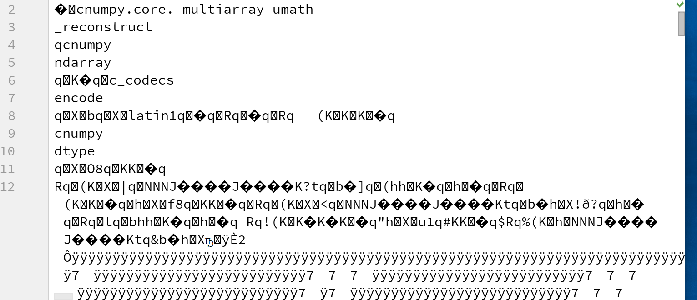

需要用numpy.load()函数打开

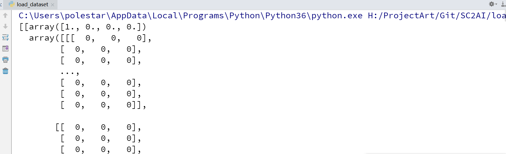


### Ch10 建立神经网络模型

上一章中我们终于得到了自己的训练数据。原作者也提供了他自己的数据集：

https://drive.google.com/file/d/1cO0BmbUhE2HsUC5ttQrLQC_wLTdCn2-u/view

你需要在命令行中（例如powershell）安装新软件包：

```
pip install keras （原文中2.1.2版本无法安装）
pip install tensorflow-gpu （原文中1.8版本无法安装）
```

如果你不知道什么是神经网络，那么推荐你先看完以下教程中的deeplearning部分

https://pythonprogramming.net/neural-networks-machine-learning-tutorial/


### Ch11 训练神经网络

训练数据解压完有**13G**，是的你没有看错。


学习至11:30秒处